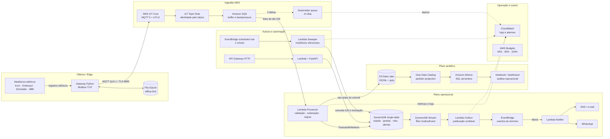

# KWATT — Inteligência Energética Industrial na AWS

Plataforma event-driven para medir, processar e analisar o consumo de energia de indústrias em tempo quase real.

O KWATT conecta medidores Modbus instalados em linhas, setores ou máquinas a uma arquitetura serverless na AWS. O sistema acompanha demanda em janelas de 15 minutos, identifica ultrapassagem da demanda contratada, monitora fator de potência, detecta medidores silenciosos e mantém um histórico analítico consultável no Athena.

> O objetivo não é apenas mostrar consumo. É transformar telemetria elétrica em ação operacional antes que uma janela ruim apareça na fatura.

## O problema

Indústrias do Grupo A pagam por energia consumida em kWh e por demanda em kW. Uma única janela de 15 minutos acima do contratado pode afetar a cobrança do mês inteiro. Ao mesmo tempo, fator de potência baixo, equipamentos operando em vazio e picos concentrados em determinados turnos criam custos que normalmente só aparecem quando a fatura já fechou.

O KWATT cria uma camada independente de observabilidade energética para responder perguntas como:

- A demanda desta janela está projetada para ultrapassar o contrato?
- Qual linha ou máquina está provocando o pico?
- Quanto foi consumido na ponta e fora de ponta?
- Em quais horários o fator de potência fica abaixo de 0,92?
- O medidor parou ou a fábrica realmente reduziu a carga?
- Qual é o perfil de carga por turno, dia da semana e unidade?

## O que o sistema entrega hoje

- Aquisição de medidores Modbus TCP por gateway de campo em Python.
- Buffer local em SQLite durante quedas de internet.
- Publicação MQTT 5 com TLS mútuo, QoS 1, espera de CONNACK e validação de PUBACK.
- Isolamento multi-tenant desde o certificado e tópico IoT até as chaves do DynamoDB e partições do S3.
- Processamento de lotes fora de ordem, duplicados e atrasados.
- Janelas de demanda alinhadas em 00, 15, 30 e 45 minutos.
- Projeção de demanda durante a janela, quando ainda existe tempo para reduzir carga.
- Alertas de ultrapassagem, fator de potência e medidor offline.
- Consolidação mensal por posto tarifário.
- Data lake bruto no S3, Glue Catalog e consultas SQL no Athena.
- API FastAPI para cadastro, operação e ingestão HTTP alternativa.
- Infraestrutura completa em Terraform, sem NAT Gateway, cluster ou servidor permanente.

## Arquitetura completa



### 1. Edge industrial

O gateway consulta cada medidor pelo mapa de registradores configurado em [`edge/config.example.yaml`](edge/config.example.yaml). As leituras incluem potência ativa e reativa, energia acumulada, tensão, corrente, frequência e fator de potência.

Se a internet cair, as amostras permanecem em SQLite. Quando a conexão retorna, o gateway descarrega o backlog usando o mesmo publicador MQTT confiável do simulador. Uma mensagem só é considerada entregue após um PUBACK de sucesso.

### 2. Fronteira de segurança IoT

Cada gateway recebe uma Thing, um certificado X.509 e uma policy próprios. A policy permite conexão somente com o nome da própria Thing e publicação apenas dentro do tenant gravado em seus atributos.

A IoT Rule não confia em `tenant_id`, `site_id` ou `meter_id` enviados no JSON. Esses campos são reconstruídos a partir do tópico autorizado `energia/{tenant}/{site}/{meter}`, impedindo que um gateway comprometido escreva em outro cliente apenas alterando o payload.

### 3. Fila e processamento

A SQS Standard absorve rajadas de gateways voltando de uma queda, oferece retry e envia mensagens persistentes para uma DLQ. A Lambda processadora trabalha com lotes de até 100 mensagens e concorrência máxima inicial de 2.

Dentro de cada lote, as leituras são:

1. validadas com Pydantic;
2. agrupadas por medidor;
3. ordenadas por timestamp;
4. persistidas no data lake;
5. aplicadas à máquina de estado do medidor;
6. consolidadas em uma única transação DynamoDB por grupo.

Essa estratégia reduz escritas, evita que vários consumidores disputem o mesmo item e mantém o resultado correto mesmo quando a SQS entrega mensagens duplicadas ou fora de ordem.

### 4. Consistência transacional e outbox

O processamento grava atomicamente:

- estado atual do medidor;
- janelas de demanda fechadas;
- consolidado mensal;
- alertas gerados;
- eventos pendentes da outbox.

A transação usa controle otimista por versão. Se outro consumidor alterar o mesmo medidor, o grupo relê o estado e reaplica as mensagens com backoff e jitter.

Os eventos não são publicados diretamente pelo processador. Eles entram na outbox dentro da mesma `TransactWriteItems`; o DynamoDB Stream aciona uma Lambda separada, que publica no EventBridge e remove o item após o sucesso. Isso elimina a janela clássica em que o estado é salvo, mas o evento ou alerta é perdido.

### 5. Processamento de tempo e dados atrasados

O estado mantém várias janelas abertas com as amostras compactadas como arrays. A integração de energia acontece sobre as amostras ordenadas no fechamento, e não conforme elas chegam.

- Duplicatas são identificadas pelo offset dentro da janela.
- Leituras atrasadas entram na posição cronológica correta.
- Até oito janelas podem permanecer abertas durante uma rajada de backlog.
- Uma carência de 60 segundos permite acomodar lotes fora de ordem.
- Silêncios superiores a 30 minutos não são preenchidos artificialmente.
- Após 2 minutos sem ingestão, o sweeper emite um único alerta de medidor offline.
- A janela pendente só é finalizada após 2 horas sem ingestão, preservando o horizonte de backlog operacional.

### 6. Plano analítico

Antes de alterar o estado operacional, o lote válido é gravado no S3 em JSON Lines compactado. Se o S3 falhar, as mensagens não são confirmadas e voltam para a fila.

Os objetos seguem partições Hive:

```text
s3://<lake>/leituras/tenant_id=<tenant>/site_id=<site>/dt=AAAA-MM-DD/<timestamp>-<hash>.jsonl.gz
```

A chave inclui um hash do conteúdo, fazendo uma reentrega idêntica sobrescrever o mesmo objeto. O Glue usa projeção de partições, dispensando crawler e `MSCK REPAIR`. O workgroup do Athena bloqueia consultas que ultrapassem 1 GB escaneado.

As consultas de exemplo em [`analytics/queries.sql`](analytics/queries.sql) cobrem:

- consumo diário por medidor;
- demanda máxima mensal por posto tarifário;
- fator de potência por hora;
- curva de carga por dia da semana e horário;
- identificação de furos na medição.

## Modelo single-table no DynamoDB

| PK | SK | Entidade | Uso |
|---|---|---|---|
| `TENANT#{tenant}` | `META` | `TenantConfig` | calendário tarifário e autenticação |
| `TENANT#{tenant}` | `SITE#{site}` | `SiteConfig` | unidade industrial |
| `TENANT#{tenant}` | `METER#{site}#{meter}` | `MeterConfig` | contrato e configuração do medidor |
| `TENANT#{tenant}` | `ALERT#{ts}#{id}` | `Alert` | timeline de alertas do cliente |
| `METER#{tenant}#{site}#{meter}` | `STATE` | `MeterState` | janelas abertas e controle de versão |
| `METER#{tenant}#{site}#{meter}` | `WINDOW#{start}` | `DemandWindow` | demanda calculada a cada 15 minutos |
| `METER#{tenant}#{site}#{meter}` | `MONTH#{YYYY-MM}` | `MonthRollup` | consumo e pico mensal por posto |
| `OUTBOX#{event_id}` | `EVENT` | `OutboxEvent` | evento pendente para o EventBridge |

O índice `states-by-ingestion` permite ao sweeper localizar somente medidores silenciosos, sem executar scan sobre janelas, alertas ou cadastros.

## API operacional

A API roda em FastAPI sobre Lambda e API Gateway HTTP. Em desenvolvimento, a documentação OpenAPI fica disponível em `/docs`.

| Método | Rota | Função |
|---|---|---|
| `POST` | `/admin/tenants` | cria tenant e retorna a chave uma única vez |
| `POST` | `/admin/tenants/{tenant}/rotate-key` | gira a chave de um tenant |
| `POST / GET` | `/tenants/{tenant}/sites` | cadastra ou lista unidades |
| `POST / GET` | `/tenants/{tenant}/meters` | cadastra ou lista medidores |
| `POST` | `/tenants/{tenant}/ingest` | ingestão HTTP em lote |
| `GET` | `/tenants/{tenant}/meters/{site}/{meter}/state` | estado, projeção e silêncio atual |
| `GET` | `/tenants/{tenant}/meters/{site}/{meter}/windows` | janelas de um dia |
| `GET` | `/tenants/{tenant}/meters/{site}/{meter}/months/{month}` | consolidado mensal |
| `GET` | `/tenants/{tenant}/alerts` | alertas recentes |

Rotas administrativas usam `X-Admin-Key`. Rotas de cliente usam `X-API-Key`, armazenada apenas como SHA-256 no DynamoDB.

## Confiabilidade por desenho

| Risco distribuído | Resposta do KWATT |
|---|---|
| MQTT publica antes da conexão | espera explícita pelo CONNACK |
| Broker rejeita uma publicação | validação do reason code do PUBACK e retry |
| Internet da fábrica cai | buffer durável em SQLite no gateway |
| Rajada na reconexão | SQS, batching e backpressure da Lambda |
| Entrega duplicada | offsets idempotentes e IDs determinísticos |
| Mensagens fora de ordem | múltiplas janelas abertas e integração cronológica |
| Dois consumidores no mesmo medidor | versão condicional, retry exponencial e jitter |
| Falha parcial ao salvar derivados | transação DynamoDB |
| Estado salvo e evento perdido | transactional outbox + DynamoDB Stream |
| S3 indisponível | lote volta à SQS antes do commit operacional |
| Medidor para de transmitir | GSI + sweeper agendado + alerta offline |
| Mensagem envenenada | retry limitado e DLQ com retenção de 14 dias |

## Observabilidade e proteção de custos

- Logs separados por Lambda no CloudWatch.
- Alarme para mensagens na DLQ.
- Alarme para idade da mensagem mais antiga na fila.
- Alarmes de erro do processador e da outbox.
- Alarme para atraso do iterator da outbox.
- Budget mensal com notificações em 50%, 90% e 100% previsto.
- DynamoDB em modo on-demand.
- S3 com transição para Standard-IA em 90 dias e Glacier Instant Retrieval em 365 dias.
- Resultados do Athena expiram após 30 dias.
- Nenhuma VPC, NAT Gateway, instância, cluster ou endpoint de inferência ligado 24/7.

## Stack

| Camada | Tecnologia |
|---|---|
| Edge | Python, pymodbus, SQLite, Paho MQTT 5 |
| Ingestão | AWS IoT Core, X.509, SQS, DLQ |
| Processamento | AWS Lambda, Pydantic, DynamoDB Transactions |
| Eventos | DynamoDB Streams, transactional outbox, EventBridge |
| Notificações | SNS e WhatsApp Cloud API |
| API | FastAPI, Mangum, API Gateway HTTP |
| Analytics | S3, Glue Data Catalog, Athena, SQL |
| Infraestrutura | Terraform |
| Qualidade | Pytest, Moto, Ruff |

## Executar localmente

Requisitos: Python 3.12 ou superior.

```powershell
git clone https://github.com/Matheus-27mm/AWS-KWATT.git
cd AWS-KWATT
python -m venv .venv
.venv\Scripts\Activate.ps1
pip install -e ".[dev,edge]"
pytest
python scripts\local_runner.py --hours 24
```

Para subir a API local:

```powershell
$env:ENERGIA_ADMIN_API_KEY = "troque-esta-chave"
uvicorn energia.api.app:create_app --factory --reload
```

O runner executa um dia de fábrica simulada usando os mesmos modelos, regras e serviços empregados pelas Lambdas.

## Deploy na AWS

Requisitos adicionais: AWS CLI autenticada e Terraform.

```powershell
python scripts\build_lambdas.py
Copy-Item infra\terraform.tfvars.example infra\terraform.tfvars
terraform -chdir=infra init
terraform -chdir=infra plan
terraform -chdir=infra apply
```

Depois do deploy:

```powershell
python scripts\provision_device.py `
  --thing gw-fabrica-01 `
  --tenant demo `
  --site fabrica `
  --policy energia-dev-gateway `
  --thing-type energia-dev-gateway

python -m simulator.simulate `
  --mode mqtt `
  --mqtt-host (terraform -chdir=infra output -raw iot_endpoint) `
  --ca edge\certs\AmazonRootCA1.pem `
  --cert edge\certs\gw-fabrica-01\cert.pem `
  --key edge\certs\gw-fabrica-01\private.key `
  --tenant demo `
  --site fabrica `
  --meters 3 `
  --speed 60
```

O guia completo está em [`docs/SETUP-AWS.md`](docs/SETUP-AWS.md). Para evitar custos após laboratórios:

```powershell
terraform -chdir=infra destroy
```

O bucket do lake não é esvaziado automaticamente. Essa proteção é intencional para impedir a exclusão acidental de dados industriais.

## Evidências de engenharia

O desenho atual nasceu de falhas observadas em testes de carga, não apenas de escolhas teóricas.

Em uma execução com 2.160 leituras e três medidores, a configuração inicial com dez consumidores apresentou 61% das leituras fora de ordem e 94 conflitos de versão. A solução atual agrupa por medidor, limita concorrência, faz retry local e mantém várias janelas abertas. Os testes de regressão reproduzem rajadas com duas horas de dados embaralhados e exigem 90 de 90 amostras nas janelas completas.

Validação atual do projeto:

```text
56 testes aprovados
Ruff aprovado
Python compileall aprovado
terraform fmt aprovado
terraform validate aprovado
```

## Painel (dashboard/)

Interface web do cliente: visão geral com curva de carga e janela atual, medidores, análises do mês
e histórico de alertas. React 19 com vinext (compatível com Next), Tailwind 4, shadcn e recharts.

```bash
cd dashboard
npm install
npm run dev          # http://localhost:3000
```

Sem chave configurada o painel mostra dados demonstrativos. Em **Configurações**, informe o endereço
da API (saída `api_url` do Terraform), o cliente, a unidade e a chave `ek_...` gerada ao criar o
cliente; a chave fica só no navegador. A API precisa liberar a origem do painel na variável
`cors_origins` do Terraform (localhost já vem liberado).

Verificações: `npx tsc --noEmit`, `npm run lint`, `npm run build`. A publicação (Cloudflare Workers pelo
`wrangler` que o scaffold configurou, ou S3 com CloudFront) ainda não foi decidida.

## Estrutura do repositório

```text
src/energia/domain/       modelos, demanda, tarifa, janelas e regras
src/energia/services/     processamento e máquina de estado
src/energia/adapters/     DynamoDB, S3, EventBridge, notificações e memória
src/energia/lambdas/      processor, outbox, sweeper, notifier e API
src/energia/api/          aplicação FastAPI e routers
edge/                     gateway Modbus → MQTT e configuração de campo
simulator/                carga HTTP/MQTT com perfil industrial
analytics/                consultas Athena
dashboard/                painel web (vinext + React + Tailwind + shadcn): app/, components/, hooks/, lib/
infra/                    módulos Terraform da plataforma
scripts/                  build, provisionamento, diagnóstico e runner local
tests/                    testes unitários, integração DynamoDB com Moto e regressões
docs/                     arquitetura, domínio, decisões e setup AWS
```

## Decisões conscientes

O projeto evita serviços que aumentariam custo e complexidade sem resolver um requisito atual:

- **Sem Kafka/MSK:** SQS atende buffering, retry e desacoplamento nesta escala.
- **Sem Redshift:** Athena é proporcional ao volume atual e não fica ligado em repouso.
- **Sem Kubernetes:** nenhuma carga exige um cluster permanente.
- **Sem NAT Gateway:** as Lambdas não precisam acessar recursos privados.
- **Sem QuickSight obrigatório:** analytics permanece aberto a notebook, dashboard próprio ou ferramenta do cliente.
- **Sem hardware proprietário:** o produto integra medidores industriais disponíveis no mercado.

O racional completo, incluindo decisões alteradas depois dos testes de carga, está em [`docs/DECISOES.md`](docs/DECISOES.md).

## Estado e próximos passos

O fluxo-base já foi exercitado com simulador na AWS. A versão atual — incluindo transação, outbox e sweeper — está coberta pela suíte local e pelo `terraform validate`, mas ainda precisa de um novo `terraform apply` e de outro teste de carga no ambiente. Antes de uso comercial, os próximos marcos são:

1. homologar o mapa Modbus com um medidor físico em campo;
2. executar um piloto monitorado em uma unidade industrial;
3. comparar janelas e fechamento mensal com a fatura real;
4. adicionar dados de produção para calcular kWh por peça, lote e turno;
5. construir o painel operacional multiusuário e evoluir autenticação para Cognito;
6. compactar o lake em Parquet quando o volume justificar o job adicional.

## Documentação

- [`docs/ARQUITETURA.md`](docs/ARQUITETURA.md) — detalhes de processamento, limites e escala.
- [`docs/DOMINIO-ENERGIA.md`](docs/DOMINIO-ENERGIA.md) — demanda, postos tarifários e fator de potência.
- [`docs/DECISOES.md`](docs/DECISOES.md) — escolhas técnicas e alternativas descartadas.
- [`docs/SETUP-AWS.md`](docs/SETUP-AWS.md) — configuração da conta e primeiro deploy.

---

KWATT é um projeto de engenharia de energia, sistemas distribuídos e analytics na AWS, construído para evoluir de laboratório técnico para piloto industrial real.
